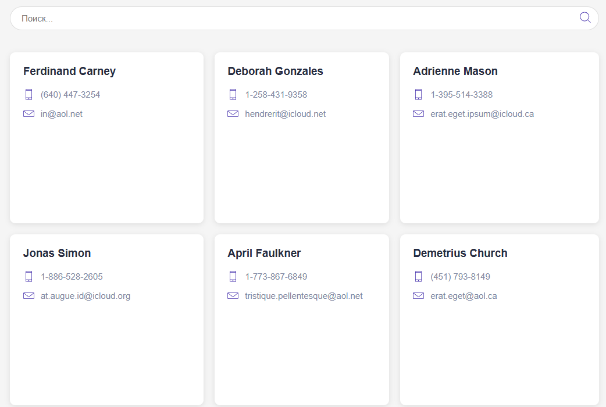
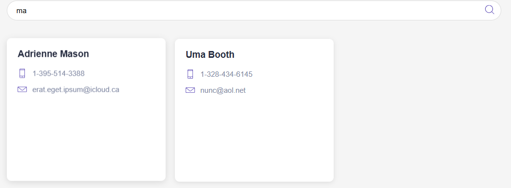

# Frontend

React приложение, которое отображает отчет о юзерах

при нажатии на кнопку поиска выполняется запрос http://localhost:3000?term=fer

#### Запуск
находясь в директории task-1 выпонить:
```
cd frontend
npm install
npm start
```




